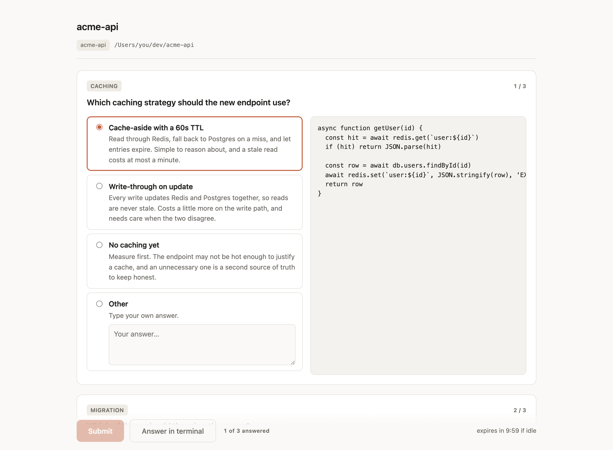
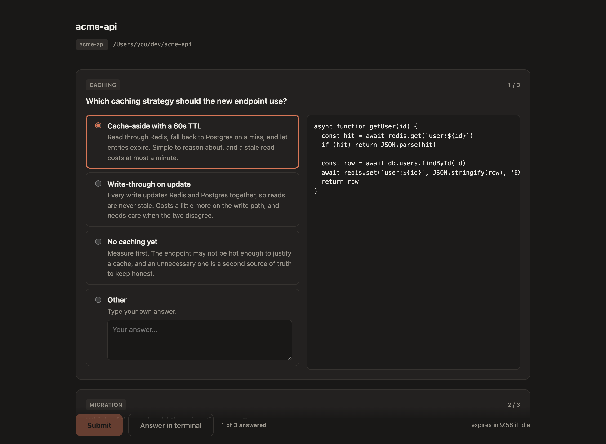
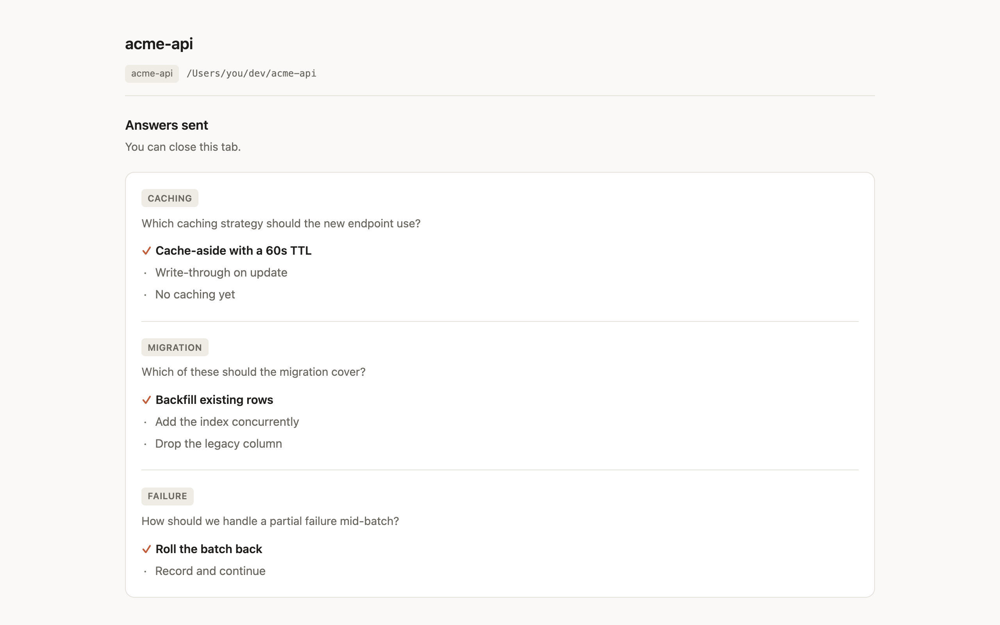

# claude-questions-in-browser

Answer Claude Code's `AskUserQuestion` prompts in a browser page instead of the terminal picker.

When Claude asks you something, a local page opens with the questions laid out — descriptions,
previews, multi-select, and a free-text box. You answer there, and Claude carries on as if you
had answered in the terminal.



<details>
<summary>Dark theme, and the summary shown after answering</summary>





</details>

## Why

The terminal picker is fine for a quick choice between two options. It is less good when the
question has four options with long descriptions, or a code preview you want to read properly,
or when you want to write a couple of paragraphs in reply. A browser page has room.

## Requirements

- **macOS.** The hook shells out to `open`, `lsappinfo` and `osascript`.
- **Node 18+**, already on your machine if you run Claude Code's usual tooling. Zero npm
  dependencies — the hook is a single file using only Node built-ins.
- **Claude Code 2.1.220 or thereabouts.** See [How it works](#how-it-works) for why the version
  matters.

## Install

Clone anywhere:

```sh
git clone https://github.com/davidsuker/claude-questions-in-browser.git ~/dev/claude-questions-in-browser
```

Then register the hook. For every project, add this to `~/.claude/settings.json`; for a single
project, add it to that project's `.claude/settings.json` instead.

```json
{
  "hooks": {
    "PreToolUse": [
      {
        "matcher": "AskUserQuestion",
        "hooks": [
          {
            "type": "command",
            "command": "node ~/dev/claude-questions-in-browser/hooks/ask-user-question-web.mjs",
            "timeout": 600
          }
        ]
      }
    ]
  }
}
```

Adjust the path to wherever you cloned it. If you already have a `PreToolUse` array, add this
entry to it rather than replacing it. Changes take effect immediately — no restart needed.

That is the whole install. Ask Claude something that prompts a question and a browser tab will
open.

## Configuration

All optional environment variables, set in the `env` block of the same `settings.json`.

### `CLAUDE_ASK_BROWSER`

The shell command used to open the page, with `{url}` substituted. Defaults to `open "{url}"`,
which uses your system default browser.

Set it if you use a **browser chooser** like [Choosy](https://choosy.app) or Velja and don't want
a chooser popup every time Claude asks a question. Naming a browser explicitly means the URL never
reaches the default handler, so the chooser is never consulted:

```json
{
  "env": {
    "CLAUDE_ASK_BROWSER": "'/Applications/Google Chrome.app/Contents/MacOS/Google Chrome' --profile-directory='Profile 3' '{url}'"
  }
}
```

That form also picks a **specific Chrome profile**, which is handy if you want Claude's questions
kept out of your main browsing window. Find the profile's directory name — `Default`, `Profile 1`,
`Profile 2`… — under `chrome://version` (look at "Profile Path"), or with:

```sh
node -e 'const fs=require("fs");const s=JSON.parse(fs.readFileSync(process.env.HOME+"/Library/Application Support/Google/Chrome/Local State","utf8"));for(const[k,v]of Object.entries(s.profile.info_cache))console.log(k,"|",v.name)'
```

> **Note:** the commonly cited `open -a "Google Chrome" --args --profile-directory=…` does **not**
> work reliably. When Chrome is already running, macOS discards everything after `--args`,
> including the URL, and nothing opens. Invoking the binary inside the app bundle directly, as
> above, avoids `open` entirely and works whether or not Chrome is running.

### `CLAUDE_ASK_ACTIVATE`

Name of an application to bring to the front once the page is open. Empty by default, so nothing
steals focus. Claude is blocked until you answer, so raising the window is usually what you want:

```json
{
  "env": {
    "CLAUDE_ASK_ACTIVATE": "Google Chrome"
  }
}
```

### `CLAUDE_ASK_KEEP_FOCUS`

Set to `1` to keep focus where it was when the question arrived. Opening a URL raises the browser
whether you asked for it or not, which is jarring if you were mid-sentence in another app — the
page still opens, and loads, but your keystrokes keep going where you were typing.

```json
{
  "env": {
    "CLAUDE_ASK_KEEP_FOCUS": "1"
  }
}
```

The hook notes the frontmost application before launching the browser, then holds the front there
for three seconds.

Takes precedence over `CLAUDE_ASK_ACTIVATE`, since the two want opposite things — and a session
started before you edited `settings.json` keeps the old `ACTIVATE` value in its environment, which
would otherwise quietly defeat the setting you just turned on.

#### It restores, it does not prevent

**You will see a brief flicker.** macOS hands the URL to the browser, the browser brings itself
forward, and only then can the hook notice and put focus back. Nothing in this hook can stop the
raise — it can only undo it, and undoing is visible.

The flicker is bounded by the poll interval, currently 100ms (`POLL_MS` in the hook). That is the
worst case between the browser taking the front and the hook noticing. Dropping it further buys
diminishing returns against more `lsappinfo` calls per second.

**If you want no flicker at all**, the browser must never be raised, which means `open -g`:

```json
{
  "env": {
    "CLAUDE_ASK_BROWSER": "open -g -a 'Google Chrome' '{url}'"
  }
}
```

Nothing is ever stolen, so `CLAUDE_ASK_KEEP_FOCUS` becomes unnecessary. The cost is profile
targeting: `open -a` hands the URL to whichever window was last used, and the profile flag cannot
be passed through it (see the `--args` note above). Launching the profile binary directly is
exactly what forces the activation. So it is flicker-with-a-chosen-profile, or
no-flicker-with-whatever-profile — pick one.

#### Why the hold repeats

A browser raises itself more than once: on launch, and again when the window renders. Restoring
focus a single time loses to the second raise, which measured at just over a second on a warm
Chrome. So the hook re-asserts the front every `POLL_MS` for the whole window rather than firing
once.

Tune the window with `CLAUDE_ASK_KEEP_FOCUS_MS` if three seconds is not enough on a cold browser.
The trade-off runs both ways:

| Window | Upside | Cost |
|---|---|---|
| Longer (5s) | Survives a slow raise on a cold browser | Clicking into the page inside the window bounces you back once |
| Shorter (1.5s) | You can click into the page sooner | A late second raise can slip through and leave you in the browser |

#### It holds *your* app, not the terminal

The app is sampled at the moment the question fires, so if you prompt Claude and move to another
app before it asks, the question opens in the background and leaves you there — it does not pull
you back to the terminal. The one exception is switching apps *during* the hold window: focus was
sampled as the terminal, so you get bounced back to it once, and only for those three seconds.

Note the flip side of all this: with nothing raising the browser, nothing announces the question
either. That is what the [status line](#status-line-integration-optional) is for.

#### Why `lsappinfo`

Frontmost app detection uses `lsappinfo`, not AppleScript, because reading the front app through
System Events needs an Automation permission you have to grant by hand — a focus nicety should not
depend on a permission prompt.

The app is identified by **bundle path**, not display name. VS Code reports its name as `Code`
while its bundle is `Visual Studio Code.app`, so `open -a Code` fails with *Unable to find
application named 'Code'* and focus is never handed back. Paths always resolve. Apps whose name
and bundle happen to match — Terminal, Finder — hide this bug, so it is worth keeping in mind if
you change this code.

### `CLAUDE_ASK_SOUND`

With focus left alone, nothing tells you a question has arrived. A sound does, from any app and
without stealing anything:

```json
{
  "env": {
    "CLAUDE_ASK_SOUND": "Submarine"
  }
}
```

Takes a name from `/System/Library/Sounds` — `Submarine`, `Glass`, `Ping`, `Hero`, `Funk`, `Tink`
and the rest — or a path to any audio file `afplay` can handle. Empty by default, because a hook
that makes noise uninvited is a bad neighbour. It cannot fail the prompt.

It plays when the page opens, then again at 60 and 120 seconds if the question is still
unanswered — one chime is easy to miss if you were away from the desk. Change or silence the
reminders with `CLAUDE_ASK_SOUND_REPEATS`, a comma-separated list of seconds (`""` for none,
`"30,90,300"` for more). They stop the moment you answer, and never nag indefinitely.

> **A terminal bell was tried and removed.** Claude Code spawns hooks without a controlling
> terminal, so writing `\x07` to `/dev/tty` fails with *device not configured* every time. There is
> nothing to ring. The sound, and the [status line](#status-line-integration-optional), are the
> surfaces that work.

## Status line integration (optional)

If the question opens in a tab that then gets buried, nothing in the terminal tells you Claude is
waiting. Claude Code's TUI repaints the screen and rewrites the window title, so neither is usable
— but the **status line** works.

While the hook is waiting it writes `/tmp/claude-ask-waiting-<session_id>` containing the URL and
the question count, and deletes it as soon as the question is resolved. Any status line script can
pick that up. Add this to yours (`statusLine.command` in `~/.claude/settings.json`), which receives
the session JSON on stdin — `jq` is used here to read the session id out of it:

```sh
input=$(cat)
session=$(echo "$input" | jq -r '.session_id // ""')

ask_seg=""
ask_flag="/tmp/claude-ask-waiting-${session}"
if [ -n "$session" ] && [ -f "$ask_flag" ]; then
  # Ignore stale flags, in case a hook was killed before it could clean up.
  if [ -z "$(find "$ask_flag" -mmin +15 2>/dev/null)" ]; then
    ask_url=$(head -1 "$ask_flag")                     # line 1: the URL
    ask_n=$(sed -n '2p' "$ask_flag")                   # line 2: how many questions
    case "$ask_n" in ''|*[!0-9]*) ask_n=1 ;; esac
    ask_marks=$(printf "%${ask_n}s" "" | tr ' ' '?')   # four questions = ????
    ask_age=$(( $(date +%s) - $(stat -f %m "$ask_flag" 2>/dev/null || echo 0) ))
    if [ "$ask_age" -ge 60 ]; then ask_for="$(( ask_age / 60 ))m"; else ask_for="${ask_age}s"; fi
    ask_seg=$(printf "\033[1;97;41m %s \033[0m\033[1;31m %s \033[0m\033[2m%s\033[0m  " "$ask_marks" "$ask_url" "$ask_for")
  fi
fi

printf "%b(your other segments here)" "$ask_seg"
```

White-on-red block rather than coloured text, because this is the one segment worth interrupting
for and it has to win against a status line you have stopped reading.

The block is one `?` per waiting question — `????` for four — and no words: a row of question
marks next to a localhost URL says what it is, and the status line has better uses for the space.
Then the URL, which most terminals make clickable, and how long it has been waiting, so a question
you walked away from reads as stale rather than new.

The flag file is **two lines**: the URL, then the question count. A status line that reads only
the first line — as every version before the count existed did — keeps working unchanged.

The flag is keyed by session id, so several Claude Code sessions can each have a question
outstanding without showing each other's.

A ready-to-adapt version is in [`examples/statusline-segment.sh`](examples/statusline-segment.sh).

## The page

- One card per question, up to the four Claude can ask at once.
- Option descriptions, and a monospace preview pane beside the options when a question has
  previews.
- Radio buttons or checkboxes depending on whether the question is multi-select.
- An **Other** textarea on every question for a free-text answer, multi-line.
- When there is more than one question, each card is marked `1 / 3`, `2 / 3` and so on, and the
  button bar keeps a live `0 of 3 answered` tally. A single question gets neither, since `1 / 1`
  is just noise.
- Submit stays disabled until every question has an answer — the tally is what tells you which
  ones are still outstanding.
- A countdown beside the buttons shows how long before the question expires; interacting with the
  page pushes that deadline back. See [Timeouts](#timeouts).
- An **Answer in terminal** button beside it, always enabled, which hands the question back to
  Claude Code's own picker. Escape does the same thing. See
  [Cancelling a question](#cancelling-a-question) for every route out, including Ctrl-C.
- Follows your system light/dark theme. No external fonts, scripts, or network requests — it is
  served from a throwaway localhost server and works entirely offline.
- The header shows the session name, project, git branch, and working directory, so you can tell
  which Claude session is asking when you have several open.
- After submitting, the page lists every option with your choices ticked and the rest dimmed, so
  the tab is a record of what you sent.

## How it works

The hook is registered on `PreToolUse` for the `AskUserQuestion` tool. When it fires it:

1. Reads the hook payload from stdin and pulls out `tool_input.questions`.
2. Starts an HTTP server bound to `127.0.0.1`, on [this session's port](#the-port).
3. Opens the page in a browser and waits — for a `POST /submit` with your answers, a
   `POST /cancel`, the flag file disappearing, or `WAIT_MS`, whichever comes first.
4. Returns `permissionDecision: "allow"` with `updatedInput` containing the tool's own
   `{ questions, answers, annotations }` — the same shape the terminal picker writes. The tool
   sees the question as already answered and skips asking.

### A caveat worth knowing

Step 4 relies on **undocumented behaviour**. Claude Code's hook documentation presents
`syntheticOutput` as the way for a hook to supply a tool's result, but for `AskUserQuestion` that
field is silently ignored — the hook looks correct, returns valid JSON, and the terminal picker
appears anyway. Pre-filling `answers` via `updatedInput` is what actually works.

That is an implementation detail nobody promised, and it could change in any release. Verified
against **Claude Code 2.1.220** (`claude --version`), by using it: every question in the session
that built this repo was answered through the page. If a future version breaks it, the symptom is
the browser page
opening and the terminal *also* asking.

### Cancelling a question

While the page is open, Claude Code is **blocked** on the hook process and is not reading your
keyboard. That shapes everything below: your normal reflexes do not all work.

| Route | Where | What Claude sees |
|---|---|---|
| **Ctrl-C** | The blocked terminal | Question declined |
| **Answer in terminal** button, or Escape | The browser page | `defer` — the question reappears in the built-in picker |
| `rm /tmp/claude-ask-waiting-*` | Any *other* terminal | `defer`, within a second |
| Wait it out | — | `defer`, after `WAIT_MS` |

**Escape in the terminal does nothing.** Claude Code puts the terminal in raw mode, so Escape is
just a byte it has to read and act on — and it is not reading. Nothing typed reaches it.

**Ctrl-C is the exception**, because it is not read as input at all: it is delivered to the process
group as a signal, which reaches the hook directly. The hook cleans up and exits, and Claude Code
reports the question as declined. This is the quickest way out.

**From the page**, the **Answer in terminal** button (or Escape in the browser, which is bound to
the same thing) posts to `/cancel`. The hook takes the same `defer` route as any other failure, so
the question reappears in Claude Code's built-in picker, unchanged. Nothing is lost — and once the
hook exits, Escape in the terminal works normally again, because the session is no longer blocked.

**If the browser is not an option** — tab closed, page never opened, wrong machine — delete the
flag file from any other terminal window. The hook polls for it once a second and gives up as soon
as it disappears, exactly as if you had clicked the button:

```sh
rm /tmp/claude-ask-waiting-*
```

Note this cancels *every* waiting session; with several Claude Code windows open, run
`ls /tmp/claude-ask-waiting-*` and delete only the session id you mean. Worth an alias if you hit
it often:

```sh
alias unstick='rm -f /tmp/claude-ask-waiting-*'
```

That file is the same one the [status line](#status-line-integration-optional) reads, and it holds
the page URL — so `open "$(cat /tmp/claude-ask-waiting-*)"` reopens a lost tab if you would rather
answer after all.

However the hook ends, the status line clears with it: `SIGINT`, `SIGTERM` and `SIGHUP` all remove
the flag file before exiting, so a Ctrl-C'd question does not leave `[?] question waiting` pointing
at a server that is already gone. Only `SIGKILL` escapes that, and a stray flag can be removed by
hand with the same `rm`.

### The port

Each session gets its own port, and keeps it. The hook hashes `session_id` (FNV-1a) and folds the
result into `49152–65535` — the ephemeral range macOS would have assigned from anyway, so this is
not squatting on any registered port. The same session therefore lands on the same URL for every
question, and two sessions asking at once still get different ports with no coordination between
them.

This is stateless on purpose. The hook is a fresh process per question, so anything remembered
would need a file to store it and another to clean up; the hash reproduces the same answer from
the session id alone.

**It is a preference, not a reservation.** Nothing holds the port between questions, so another
process can take it while you are not being asked. On `EADDRINUSE` the hook logs the collision and
falls back to `listen(0)`, letting the OS pick — a taken port must never cost you the question.

The practical use is a **pinned tab**: keep the URL open, and refresh it when the status line says
a question is waiting, rather than hunting for the newest tab. Between questions there is no
listener, so a refresh in the gap gives a connection error — the server exists only for as long as
a question is outstanding.

### It fails safe

Every failure path — unparseable payload, no questions, browser won't launch, no answer before the
timeout — prints `permissionDecision: "defer"` and exits 0, which hands the question back to the
built-in terminal picker. A broken hook degrades to normal Claude Code rather than wedging your
session.

### Timeouts

Three, and the order matters:

| Where | Default | What it is |
|---|---|---|
| `timeout` in `settings.json` | `600` seconds | Claude Code's limit. Exceed it and the process is **killed** — no output, so no graceful fallback. |
| `CLAUDE_ASK_WAIT_MS` | `570000` ms | Hard ceiling on the whole wait, whatever you do. |
| `CLAUDE_ASK_IDLE_MS` | `300000` ms | How long the page may go **untouched** before the question expires. |

`WAIT_MS` is deliberately shorter than `timeout`, so the hook can surrender and `defer` before the
harness kills it. **If you change one, change both**, keeping `WAIT_MS` comfortably below
`timeout × 1000`.

The idle clock is the one you will actually meet. Typing, clicking or focusing the page pushes it
back — the page pings `/keepalive`, throttled to one call every ten seconds — so a question you are
working through does not expire mid-thought, while one you have abandoned still gives up promptly.
Extensions never exceed `WAIT_MS`, so there is no way to keep the session blocked indefinitely.

The remaining time is shown as a countdown next to the buttons, turning accent-coloured for the
final minute. It is always visible — a timer that appears only near the end is itself a surprise,
and watching it reset as you work is how you know the extension is real.

The label says which clock is running, because a number that sometimes jumps back and sometimes
does not looks broken:

- **`expires in 4:59 if idle`** — the idle clock. Typing, clicking or focusing the page resets it,
  and the reset is applied to the display **immediately**, on every interaction. Only the ping to
  the hook is throttled; earlier the display was throttled too, which made some keystrokes appear
  to reset the clock and others not, depending on where they landed in the ten-second window.
- **`expires in 0:59 — session limit`** — the hard ceiling. Nothing you do extends this one, so the
  clock does not reset. This is what you see near `WAIT_MS`, or whenever `IDLE_MS` was clamped down
  to it.

To make the idle clock meaningful, raise the hard ceiling: with `timeout` at `3600` and
`CLAUDE_ASK_WAIT_MS` at `3540000`, a question can stay open for the better part of an hour as long
as you keep touching it, and still expires five minutes after you walk away.

## Limitations

- macOS only, as above.
- Refreshing the page after you submit gives a connection error. The server only exists while the
  hook is waiting; once it has your answer it must exit to hand that answer back to Claude. The
  [port is stable per session](#the-port), so the same tab works again at the next question — but
  it will not tell you one has arrived, and every question still opens a tab of its own.
- Focus is restored, not protected: with `CLAUDE_ASK_KEEP_FOCUS` the browser still flashes to the
  front for a moment before the hook takes focus back. See
  [it restores, it does not prevent](#it-restores-it-does-not-prevent) for why, and the `open -g`
  alternative that avoids it entirely.
- The notification and terminal-title routes were tried and abandoned: `osascript` notifications
  cannot be made to open a URL when clicked, and the terminal title is composed by the terminal
  emulator and rewritten by Claude Code. The status line is the surface that works.

## License

MIT — see [LICENSE](LICENSE).
